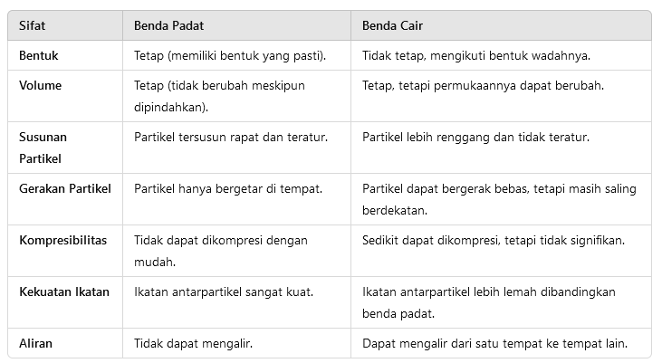
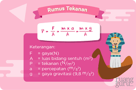

# IPA

# ZAT CAIR KE GAS → Menguap

# Benda Yang Memiliki Bentuk dan Volume Tetap → Padat

# Gas → Cair = Mengembun

# Es → Cair = Mencair

# Bahan Yang Dapat Dipisahkan Dengan Penyaringan

Penyaringan adalah metode pemisahan campuran berdasarkan perbedaan ukuran partikel. Beberapa bahan yang dapat dipisahkan melalui penyaringan meliputi:

1. **Campuran padat-cair**
    - Pasir dan air
    - Lumpur dan air
    - Serbuk kopi dengan air panas
2. **Campuran padat-gas (dalam skala tertentu)**
    1. **Campuran padat-padat** (dengan perbedaan ukuran yang signifikan)
        - Serbuk kayu dan kerikil
    - Debu dalam udara menggunakan filter udara

Metode penyaringan umumnya menggunakan alat seperti saringan, kertas saring, atau filter khusus tergantung pada kebutuhan. Saringan kasar digunakan untuk partikel besar, sedangkan kertas saring halus digunakan untuk partikel kecil seperti endapan kimia.

Contoh campuran yang dapat dipisahkan dengan metode filtrasi adalah:

    Air kopi: memisahkan kopi dari ampasnya
    Air parutan kelapa: memisahkan santan dari ampas parutan kelapa
    Air keruh: memisahkan pengotor untuk mendapatkan air bersih
    Campuran pasir dan kerikil: memisahkan pasir dari kerikil
    Teh tubruk: memisahkan air teh dari daun tehnya
    Udara kotor: memisahkan debu untuk mendapatkan udara bersih
    Darah: memisahkan darah dari zat beracun (dilakukan oleh ginjal)
    Air kapur: memisahkan bubuk kapur dari air
    Air pasir: memisahkan pasir dari air.

## **CIRI-CIRI BENDA GAS**

1. Benda gas dapat bergerak ke segala arah bahkan tanpa campur tangan manusia, alias bisa bergerak secara alami
2. Partikel zat gas bisa menyebar ke segala arah
3. Bentuknya berubah-ubah sesuai dengan tempatnya
4. Volumenya berubah-ubah mengikuti tempatnya
5. Kerapatannya rendah
6. Susunan partikel gas sangat renggang karena gaya tarik antar partikel sangat lemah
7. Benda gas tidak dapat digenggam seperti benda padat, dan sebagian besar [gas](https://www.fajarpendidikan.co.id/tag/gas/) tidak terlihat.

# Cara Memisahkan Pasir dan Air

Dengan demikian, campuran air dengan pasir dapat dipisahkan dengan cara **metode filtrasi (penyaringan) yang berdasarkan ukuran partikel zat yang berbeda**.
 Hal ini karena pasir sebagai fase padat akan tertahan pada medium 
penyaring dan air sebagai fasa cair akan melewati medium filter.

# Tata Surya

## Macam-Macam Perpindahan Kalor

Nah, sudah paham kan, tentang benda konduktor dan isolator? Sekarang kita bahas tentang jenis perpindahan kalor, yuk! Cara perpindahan kalor terbagi menjadi tiga nih, *guys*! Ada **konduksi**, **konveksi**, dan **radiasi**. Yuk, kita bahas satu per satu!

### 1. Konduksi

Perpindahan kalor secara konduksi adalah proses perpindahan kalor yang terjadi pada suatu zat **tanpa disertai** **perpindahan partikel-partikel dari zat tersebut**. Konduksi umumnya terjadi pada zat **padat** terutama yang bersifat konduktor.

### 2. Konveksi

Perpidahan kalor secara konveksi adalah proses perpindahan kalor yang terjadi pada suatu zat **dengan disertai perpindahan partikel-partikel dari zat tersebut**. Konveksi umumnya terjadi pada **fluida** (zat cair dan gas).

### 3. Radiasi

Radiasi adalah perpindahan kalor yang tanpa diperantarai oleh suatu medium.

# Perubahan Yang Membuat Zat Baru Adalah

**Perubahan kimia** adalah perubahan yang menghasilkan suatu [zat](https://id.wikipedia.org/wiki/Zat) baru[[1]](https://id.wikipedia.org/wiki/Perubahan_kimia#cite_note-1) dan tidak dapat dikembalikan.[[2]](https://id.wikipedia.org/wiki/Perubahan_kimia#cite_note-:0-2) Perubahan menghasilkan jenis dan sifat [materi](https://id.wikipedia.org/wiki/Materi) berbeda (baru) dari zat semula dinamakan (perubahan kimia dinamakan juga [reaksi kimia](https://id.wikipedia.org/wiki/Reaksi_kimia) atau reaksi)[[3]](https://id.wikipedia.org/wiki/Perubahan_kimia#cite_note-:1-3) yang melibatkan penataan ulang [atom](https://id.wikipedia.org/wiki/Atom) dari satu atau lebih zat dan perubahan dalam sifat atau komposisinya.[[4]](https://id.wikipedia.org/wiki/Perubahan_kimia#cite_note-4) Perububahan kimia mengakibatkan terjadinya perubahan susunan [molekul](https://id.wikipedia.org/wiki/Molekul) kimia pada suatu benda. Dan pada umumnya, perubahan susunan kimia tersebut akan menyebabkan perubahan fisik pula.[[5]](https://id.wikipedia.org/wiki/Perubahan_kimia#cite_note-:2-5)

# Kondisi Pembiasan Cahaya

Pembiasan cahaya merupakan peristiwa 
perubahan arah rambat cahaya ketika berpindah dari satu medium ke medium
 lain yang kerapatan optiknya berbeda. Penyebab terjadinya pembiasan 
cahaya dibagi menjadi 2 yaitu:

1. Ketika sinar datang dari medium yang kurang rapat menuju medium yang lebih rapat maka sinar datang akan dibiaskan mendekati garis normal.
Contohnya ketika sinar datang melalui medium udara menuju air.
2. Ketika sinar datang dari medium yang lebih rapat menuju medium yang
kurang rapat maka sinar datang akan dibiaskan menjauhi garis normal.
Contohnya ketika sinar datang melalui medium air menuju udara.

**Pembiasan cahaya** terjadi ketika cahaya melewati batas antara dua medium yang memiliki **indeks bias berbeda**. Kondisi yang memungkinkan terjadinya pembiasan adalah:

1. **Cahaya melewati dua medium yang berbeda**
    - Medium pertama dan kedua harus memiliki indeks bias yang tidak sama. Contoh: udara ke air, kaca ke udara, atau air ke kaca.
    - Jika medium memiliki indeks bias sama, cahaya hanya melanjutkan perjalanannya tanpa dibelokkan.
2. **Cahaya datang dengan sudut tertentu**
    - Jika cahaya datang tegak lurus terhadap permukaan batas medium (sudut datang = 0°), pembiasan tidak terlihat, hanya terjadi perubahan kecepatan dan panjang gelombang.
    - Jika sudut datang ≠ 0°, cahaya akan dibelokkan saat memasuki medium lain.
3. **Perbedaan kecepatan cahaya di kedua medium**
    - Pembiasan terjadi karena cahaya merambat dengan kecepatan berbeda di medium yang memiliki kerapatan optik berbeda.
    - Cahaya melambat ketika memasuki medium dengan kerapatan optik lebih tinggi (indeks bias lebih besar), dan mempercepat di medium dengan kerapatan optik lebih rendah.
4. **Hukum Snell**
    - Arah pembiasan ditentukan oleh Hukum Snell:
    
    Di mana  dan  adalah indeks bias medium pertama dan kedua, sedangkan  dan  adalah sudut datang dan sudut bias.
        
        n1sin⁡θ1=n2sin⁡θ2n_1 \sin \theta_1 = n_2 \sin \theta_2
        
        n1n_1
        
        n2n_2
        
        θ1\theta_1
        
        θ2\theta_2
        

**Contoh Kasus Pembiasan**

- **Pena terlihat patah** saat sebagian terendam dalam air.
- **Pelangi** terbentuk akibat pembiasan dan dispersi cahaya di tetesan air hujan.
- **Lensa kacamata** membelokkan cahaya untuk memperbaiki penglihatan.

Kondisi ini memengaruhi arah, kecepatan, dan panjang gelombang cahaya saat berpindah medium.

# Monokotil

Ciri-ciri tumbuhan monokotil
    Memiliki biji tunggal atau berkeping satu
    Memiliki akar yang berserabut
    Tidak membelah saat berkecambah
    Memiliki daun halus dan bertulang sejajar
    Memiliki batang tidak bercabang dan beruas-ruas
    Ujung batang dilindungi oleh koleoptil
    Tidak mempunyai kambium pada batang maupun akarnya
    Sebagian besar memiliki bunga yang tersusun dari mahkota bunga, kelopak bunga, dan benar sari berjumlah tiga buah
Contoh tumbuhan monokotil
Tumbuhan monokotil hanya memiliki biji tunggal atau tidak terbelah. Contoh dari tumbuhan monokotil yakni
    jagung,
    bambu,
    padi,
    kangkung,
    rumput teki,
    kelapa,
    kunyit,
    jahe,
    anggrek pisang,
    nanas, dan
    lainnya.

# Dikotil

Ciri-ciri tumbuhan dikotil
    Mempunyai biji berkeping dua
    Membelah saat berkecambah
    Memiliki akar tunggang
    Memiliki batang bercabang
    Tulang daun oval atau berjari
    Tidak memiliki tudung akar
    Batang berkambium
    Akar dan batang memiliki bentuk yang membesar
    Memiliki xilem dan floem
    Bagian bunga tersusun dari mahkota, kelopak bunga, dan benang sari berjumlah 2, 4, 5, atau kelipatannya.
Contoh tumbuhan dikotil
Tumbuhan dikotil didefinisikan sebagai tumbuhan yang memiliki biji berkeping dua. Adapun contoh dari tumbuhan dikotil yaitu
    mangga,
    pepaya,
    cempedak,
    sirih,
    belimbing,
    tanaman karet,
    pohon jarak,
    kacang-kacangan,
    cabai, dan
    tomat. 

# Ekologi

**Rantai makanan** adalah suatu ekosistem makhluk hidup yaitu perpindahan energi [makanan](https://id.wikipedia.org/wiki/Makanan) dari sumber daya tumbuhan melalui seri [organisme](https://id.wikipedia.org/wiki/Organisme)
 atau melalui jenjang makan di mana suatu organisme memakan satu sama 
lain untuk mendapatkan energi dan nutrisi dari organisme yang dimakan. 
Rantai makanan merupakan bagian dari [jaring-jaring makanan](https://id.wikipedia.org/wiki/Jaring-jaring_makanan), di mana rantai makanan bergerak secara linear dari produsen ke konsumen teratas.[[1]](https://id.wikipedia.org/wiki/Rantai_makanan#cite_note-1)

*Ekosistem adalah* suatu sistem ekologi yang terbentuk oleh hubungan timbal balik tak terpisahkan antara makhluk hidup dengan lingkungannya.

# Jaringan Meristem

## **Apa Fungsi Jaringan Meristem?**

### Pertumbuhan

Fungsi
 utama jaringan meristem adalah menghasilkan sel-sel baru untuk 
pertumbuhan tanaman. Artinya, jaringan meristem memungkinkan tumbuhan 
untuk menjadi lebih tinggi, akarnya jadi lebih dalam, dan bagian-bagian 
dari tumbuhan menjadi terbentuk.

### Pemulihan

Jaringan meristem juga berperan dalam proses pemulihan dan perbaikan jika tanaman mengalami cedera atau kerusakan.

### Pengembangan Organ

Sel-sel
 meristem akan berkembang menjadi berbagai jenis jaringan, seperti akar,
 daun, batang, dan bunga. Ini memungkinkan tanaman memiliki berbagai 
bagian yang diperlukan untuk fungsinya.

### Reproduksi Aseksual

Pada
 beberapa tanaman, jaringan meristem juga berperan dalam reproduksi 
aseksual. Sebuah tanaman baru dapat tumbuh dari fragmen jaringan 
meristem yang ditanamkan.

### Respons Terhadap Lingkungan

Jaringan
 meristem juga bisa merespons perubahan lingkungan, seperti cahaya atau 
gravitasi, untuk mengarahkan pertumbuhan tanaman sesuai kebutuhan.

# Cara Menghitung Kecepatan:

Dampak pencemaran udara dari asap kendaraan, asap pabrik, asap rokok, dan lain-lain bisa **memicu terjadinya gangguan pernapasan, seperti asma, ISPA, dan kanker paru-paru**.
 Selain itu, pencemaran udara juga bisa berakhir pada berkurangnya kadar
 oksigen di dalam tubuh manusia, sehingga membahayakan kesehatan.

Sumber daya alam terbarukan adalah

sumber daya alam yang dapat diperbarui secara alami dan berkelanjutan

. Beberapa contoh sumber daya alam terbarukan adalah:

- **Air** Energi yang dihasilkan dari air yang bergerak. Air dapat dimanfaatkan untuk minum, memasak, mandi, mencuci, dan menyiram tanaman.
- **Angin** Energi yang dihasilkan dari angin dan dapat diubah menjadi energi kinetik atau listrik dengan menggunakan kincir angin. Angin dapat dimanfaatkan untuk menyegarkan tubuh, menerbangkan pesawat, dan mengembangkan layar pada perahu.

**Biomassa** Energi yang berasal dari organisme hidup atau baru saja mati, seperti kayu bakar, limbah, dan alkohol. Biomassa dapat dimanfaatkan untuk menghasilkan energi alternatif seperti biogas, biofuel cair, dan biofuel padat.

- **Biomassa** Energi yang berasal dari organisme hidup atau baru saja mati, seperti kayu bakar, limbah, dan alkohol. Biomassa dapat dimanfaatkan untuk menghasilkan energi alternatif seperti biogas, biofuel cair, dan biofuel padat.

**Panas bumi** Energi panas yang berasal dari inti bumi dan terkandung dalam air panas, uap air, batuan, dan gas lainnya. Panas bumi dapat dimanfaatkan untuk menghasilkan energi listrik dan proses pembuangan limbah.

- **Panas bumi** Energi panas yang berasal dari inti bumi dan terkandung dalam air panas, uap air, batuan, dan gas lainnya. Panas bumi dapat dimanfaatkan untuk menghasilkan energi listrik dan proses pembuangan limbah.

**Sinar matahari** Energi yang bersumber dari radiasi sinar dan panas yang dipancarkan matahari. Sinar matahari dapat dimanfaatkan untuk menjemur pakaian, mendapatkan vitamin D alami, dan memperoleh kehangatan.

- **Sinar matahari** Energi yang bersumber dari radiasi sinar dan panas yang dipancarkan matahari. Sinar matahari dapat dimanfaatkan untuk menjemur pakaian, mendapatkan vitamin D alami, dan memperoleh kehangatan.

Selain sumber daya alam terbarukan, ada juga sumber daya alam yang tidak dapat diperbarui, seperti emas, perak, dan minyak bumi.

- 

Selain sumber daya alam terbarukan, ada juga sumber daya alam yang tidak dapat diperbarui, seperti emas, perak, dan minyak bumi.

# Pertumbuhan dan Perkembangan:

1. Pertumbuhan

Pertumbuhan dapat diartikan sebagai pertambahan biomassa yang sifatnya

tetap dan irreversible (tidak dapat balik)

Pertumbuhan adalah proses fisik pada makhluk hidup yang menyebabkan peningkatan ukuran dan berat tubuh. Proses ini terjadi karena adanya pertambahan jumlah sel dan pembesaran sel. Pertumbuhan merupakan mekanisme fundamental yang mendukung perkembangan makhluk hidup.

Pertumbuhan bersifat kuantitatif, artinya dapat diukur dan dinyatakan dengan angka, seperti panjang, berat, dan volume tubuh.

Pertumbuhan
 pada tumbuhan tidak terbatas pada usia asalkan kebutuhannya terpenuhi, 
sedangkan pada hewan dan manusia pertumbuhan bersifat terbatas.

Ciri-ciri pertumbuhan adalah:

- **Kuantitatif**: Pertumbuhan dapat diukur secara jelas melalui ukuran fisik, seperti panjang, tinggi, berat, atau volume.
- **Proses fisiologis**: Pertumbuhan terjadi melalui pembelahan sel dan peningkatan ukuran sel atau jaringan tubuh.
- **Tidak bisa mundur**: Setelah suatu organisme tumbuh, ia tidak bisa kembali ke ukuran sebelumnya.
- **Berkaitan dengan peningkatan ukuran**: Pertumbuhan berhubungan langsung dengan peningkatan ukuran fisik.
- **Mengikuti perjalanan waktu**: Pertumbuhan terjadi seiring berjalannya waktu.

**Setiap anak memiliki pertumbuhan tertentu**: Dalam keadaan normal, setiap anak memiliki pertumbuhan tertentu. 

- **Setiap anak memiliki pertumbuhan tertentu**: Dalam keadaan normal, setiap anak memiliki pertumbuhan tertentu.
1. Perkembangan

Sementara itu, berbeda dengan pertumbuhan, perkembangan bisa diartikan dengan keadaan di mana sel-sel menjadi struktur dan fungsi tertentu. Perkembangan tidak dapat diukur namun bisa terlihat perubahannya, dilihat dari bentuk dan tingkat kedewasaan.

# Sistem Saraf

**Sistem koordinasi manusia** adalah sistem yang mengatur dan mengintegrasikan fungsi organ-organ tubuh sehingga bekerja secara harmonis. Sistem ini terdiri dari tiga komponen utama, yaitu **sistem saraf**, **sistem endokrin (hormon)**, dan **indera**. Berikut penjelasannya:

---

### **1. Sistem Saraf**

Sistem saraf berfungsi mengirimkan dan menerima impuls atau sinyal listrik untuk mengatur respons tubuh secara cepat.

- **Komponen Sistem Saraf**:
    1. **Sistem Saraf Pusat**:
        - **Otak**: Mengontrol fungsi tubuh dan proses berpikir.
            - **Otak besar (cerebrum)**: Berfungsi untuk berpikir, berbicara, dan mengontrol gerakan sadar.
            - **Otak kecil (cerebellum)**: Mengatur keseimbangan dan koordinasi gerak.
            - **Batang otak (brainstem)**: Mengatur fungsi vital seperti pernapasan dan detak jantung.
        - **Sumsum tulang belakang**: Menghubungkan otak dengan saraf tubuh lainnya.
    2. **Sistem Saraf Perifer**:
        - **Saraf somatik**: Mengatur gerakan sadar.
        - **Saraf otonom**: Mengatur fungsi otomatis seperti denyut jantung dan pencernaan.
            - Dibagi lagi menjadi **simpatis** (respons "fight or flight") dan **parasimpatis** (respons istirahat dan pencernaan).
- **Fungsi Sistem Saraf**:
    - Menerima rangsangan dari luar dan dalam tubuh.
    - Memproses informasi di otak dan sumsum tulang belakang.
    - Mengirimkan respons ke organ atau jaringan target.

---

### **2. Sistem Endokrin (Hormon)**

Sistem endokrin mengatur fungsi tubuh melalui sekresi hormon yang dibawa oleh darah ke organ target.

- **Kelenjar Utama dalam Sistem Endokrin**:
    - **Hipofisis (pituitary)**: Mengontrol kelenjar endokrin lainnya, termasuk hormon pertumbuhan.
    - **Tiroid**: Mengatur metabolisme tubuh.
    - **Paratiroid**: Mengontrol kadar kalsium dalam darah.
    - **Pankreas**: Mengatur kadar gula darah dengan hormon insulin dan glukagon.
    - **Adrenal**: Menghasilkan hormon adrenalin untuk respons stres.
    - **Gonad (testis dan ovarium)**: Menghasilkan hormon reproduksi seperti testosteron, estrogen, dan progesteron.
- **Fungsi Sistem Endokrin**:
    - Mengatur pertumbuhan, metabolisme, reproduksi, dan respons stres.

---

### **3. Sistem Indera**

Sistem indera memungkinkan manusia menerima rangsangan dari lingkungan dan memberikan informasi kepada sistem saraf.

- **Lima Indera Utama**:
    1. **Mata (penglihatan)**: Mendeteksi cahaya dan warna.
    2. **Telinga (pendengaran dan keseimbangan)**: Mendeteksi suara dan posisi tubuh.
    3. **Hidung (penciuman)**: Mendeteksi bau.
    4. **Lidah (pencicipan)**: Mendeteksi rasa (manis, asin, asam, pahit, dan umami).
    5. **Kulit (peraba)**: Mendeteksi sentuhan, tekanan, suhu, dan nyeri.

---

### **Keterpaduan Sistem Koordinasi**

Sistem koordinasi bekerja melalui hubungan antara sistem saraf, hormon, dan indera:

- **Indera** mendeteksi rangsangan dan mengirimkan sinyal ke **sistem saraf**.
- **Sistem saraf** memproses informasi dan memberikan instruksi kepada tubuh.
- **Sistem endokrin** menghasilkan hormon untuk respons jangka panjang, seperti pertumbuhan atau adaptasi terhadap stres.

Sistem koordinasi ini menjaga homeostasis tubuh dan memungkinkan manusia beradaptasi dengan lingkungannya.

Gerak refleks adalah respons tubuh yang terjadi secara otomatis tanpa melibatkan kesadaran, biasanya sebagai mekanisme perlindungan tubuh. Contoh gerak refleks tubuh meliputi:

1. **Refleks Lutut (Knee-Jerk Reflex)**
    
    Ketika lutut dipukul ringan tepat di bawah tempurungnya (patella), kaki akan menendang ke depan secara otomatis.
    
2. **Menarik Tangan dari Benda Panas**
    
    Jika tangan menyentuh sesuatu yang panas, tangan akan segera ditarik sebelum Anda menyadari rasa panas tersebut.
    
3. **Berkedip Saat Ada Benda Mendekat ke Mata**
    
    Mata secara otomatis berkedip ketika ada benda yang mendekat untuk melindungi mata dari cedera.
    
4. **Batuk atau Bersin**
    
    Ini adalah refleks untuk membersihkan saluran pernapasan dari benda asing, debu, atau iritasi.
    
5. **Mengangkat Kaki Saat Menginjak Benda Tajam**
    
    Jika kaki menyentuh benda tajam, Anda akan secara otomatis mengangkatnya untuk menghindari rasa sakit lebih lanjut.
    
6. **Refleks Menelan**
    
    Ketika makanan mencapai bagian belakang mulut, proses menelan terjadi secara otomatis tanpa perlu Anda pikirkan.
    
7. **Refleks Bayi (Misalnya, Refleks Moro atau Refleks Menggenggam)**
    
    Pada bayi, gerakan seperti menggenggam tangan atau meregangkan tubuh saat merasa terkejut adalah contoh refleks bawaan.
    

Gerak refleks melibatkan sistem saraf perifer dan medula spinalis, tanpa perlu melibatkan otak untuk memprosesnya terlebih dahulu.

**Pembuahan** adalah proses bertemunya sel sperma dari individu jantan dengan sel telur (ovum) dari individu betina, yang menghasilkan penyatuan materi genetik kedua sel tersebut. Proses ini mengawali pembentukan zigot, yaitu sel pertama dari makhluk hidup baru yang akan berkembang menjadi embrio.

### Jenis Pembuahan:

1. **Pembuahan Internal**
    
    Terjadi di dalam tubuh betina, seperti pada mamalia, burung, dan reptil. Sel sperma dibawa ke tubuh betina melalui alat reproduksi, dan pembuahan terjadi di saluran reproduksi, seperti tuba fallopi pada manusia.
    
2. **Pembuahan Eksternal**
    
    Terjadi di luar tubuh betina, seperti pada ikan dan amfibi. Sel telur dan sperma dilepaskan ke lingkungan, biasanya air, di mana pembuahan terjadi.
    

### Tahapan Pembuahan:

1. **Penetrasi Sperma ke Sel Telur**
    
    Sperma mendekati dan menembus lapisan pelindung sel telur.
    
2. **Penyatuan Inti (Fusi Nukleus)**
    
    Materi genetik dari sperma dan sel telur bergabung untuk membentuk zigot dengan jumlah kromosom lengkap.
    
3. **Pembentukan Zigot**
    
    Zigot mulai melakukan pembelahan sel dan berkembang menjadi embrio.
    

Proses pembuahan merupakan langkah awal reproduksi seksual yang memungkinkan pewarisan sifat genetik dari kedua orang tua kepada keturunan.

**Menstruasi** adalah proses keluarnya darah dan jaringan dari dinding dalam rahim (endometrium) melalui vagina, yang terjadi secara teratur pada wanita yang telah memasuki masa pubertas hingga menopause, kecuali selama kehamilan. Menstruasi adalah bagian dari siklus menstruasi yang dikendalikan oleh hormon reproduksi, yaitu estrogen dan progesteron.

### Proses Menstruasi:

1. **Persiapan Dinding Rahim**
    
    Setiap bulan, dinding rahim (endometrium) menebal sebagai persiapan untuk menerima sel telur yang telah dibuahi.
    
2. **Tidak Terjadi Pembuahan**
    
    Jika tidak ada pembuahan, tubuh akan menghentikan produksi hormon progesteron, menyebabkan lapisan dinding rahim meluruh.
    
3. **Pengeluaran Darah**
    
    Jaringan dinding rahim yang meluruh dikeluarkan bersama darah melalui vagina.
    

### Siklus Menstruasi:

- Siklus menstruasi umumnya berlangsung selama **28 hari**, meskipun durasinya dapat bervariasi antara 21 hingga 35 hari.
- **Hari pertama menstruasi** dianggap sebagai awal siklus.
- **Durasi menstruasi** biasanya berlangsung 3–7 hari.

### Fase dalam Siklus Menstruasi:

1. **Fase Menstruasi**
Pengeluaran darah dan jaringan dari rahim.
2. **Fase Folikular**
Folikel di ovarium berkembang, dan dinding rahim mulai menebal kembali.
3. **Fase Ovulasi**
Sel telur dilepaskan dari ovarium, biasanya pada hari ke-14 dalam siklus 28 hari.
4. **Fase Luteal**
Jika tidak ada pembuahan, kadar hormon progesteron menurun, memicu menstruasi.

### Fungsi Menstruasi:

Menstruasi adalah mekanisme tubuh untuk mempersiapkan rahim dalam proses reproduksi. Siklus ini memungkinkan terjadinya kehamilan jika ada pembuahan sel telur oleh sperma.

Organ reproduksi laki-laki memiliki fungsi utama dalam proses reproduksi, yaitu memproduksi, menyimpan, dan mengirimkan sel sperma serta menghasilkan hormon testosteron. Berikut adalah bagian-bagian organ reproduksi laki-laki beserta fungsinya:

---

### **Bagian Eksternal**:

1. **Penis**
    - **Fungsi**:
        - Sebagai alat untuk mengantarkan sperma ke saluran reproduksi wanita saat ejakulasi.
        - Berperan dalam proses buang air kecil melalui uretra.
2. **Skrotum**
    - **Fungsi**:
        - Kantong kulit yang melindungi dan menjaga suhu testis agar optimal untuk produksi sperma (sedikit lebih dingin dari suhu tubuh).

---

### **Bagian Internal**:

1. **Testis (Buah Zakar)**
    - **Fungsi**:
        - Memproduksi sperma melalui proses spermatogenesis.
        - Menghasilkan hormon testosteron yang berperan dalam perkembangan ciri-ciri kelamin sekunder laki-laki.
2. **Epididimis**
    - **Fungsi**:
        - Tempat penyimpanan sementara sperma setelah diproduksi di testis.
        - Tempat pematangan sperma sebelum siap untuk ejakulasi.
3. **Vas Deferens**
    - **Fungsi**:
        - Saluran yang membawa sperma dari epididimis ke uretra saat ejakulasi.
4. **Kelenjar Prostat**
    - **Fungsi**:
        - Menghasilkan cairan yang menjadi bagian dari air mani (semen) untuk melindungi dan memberi nutrisi pada sperma.
5. **Kelenjar Cowper (Bulbourethral)**
    - **Fungsi**:
        - Menghasilkan cairan bening yang berfungsi untuk melumasi uretra dan menetralkan asam dari urin sebelum sperma dilepaskan.
6. **Vesikula Seminalis**
    - **Fungsi**:
        - Menghasilkan cairan kaya fruktosa sebagai sumber energi bagi sperma.
7. **Uretra**
    - **Fungsi**:
        - Saluran untuk mengeluarkan sperma dan urine dari tubuh (fungsi ekskresi dan reproduksi).

---

### **Peran Hormon:**

- **Testosteron**
    - Mengontrol produksi sperma.
    - Mengatur perkembangan ciri-ciri kelamin sekunder seperti suara berat, pertumbuhan rambut wajah, dan massa otot.

Setiap organ bekerja secara terpadu untuk mendukung fungsi reproduksi dan hormonal tubuh laki-laki.

Tekanan yang paling besar terjadi ketika gaya yang diberikan besar dan luas permukaan tempat gaya tersebut bekerja kecil. Dalam konteks fisika, tekanan dirumuskan sebagai:

P=FAP = \frac{F}{A}

di mana:

- PP = tekanan (dalam pascal atau )
    
    N/m2\text{N/m}^2
    
- FF = gaya (dalam newton)
- AA = luas permukaan tempat gaya bekerja (dalam meter persegi)

### Contoh Situasi Tekanan Besar:

1. **Paku Tajam**
    
    Paku dapat menembus benda keras karena ujungnya kecil, sehingga tekanan yang dihasilkan sangat besar meskipun gaya yang diberikan tidak terlalu besar.
    
2. **Pisau Tajam**
    
    Pisau dengan mata yang tajam memiliki luas permukaan kecil pada bagian tajamnya, sehingga tekanan yang dihasilkan besar dan memudahkan untuk memotong benda.
    
3. **Jarum Suntik**
    
    Ujung jarum yang sangat kecil menghasilkan tekanan yang sangat besar, memungkinkan jarum menembus kulit dengan gaya yang kecil.
    
4. **Sepatu Hak Tinggi**
    
    Hak sepatu yang kecil memberikan tekanan lebih besar pada lantai dibandingkan dengan sepatu datar, karena luas permukaan yang bersentuhan dengan lantai lebih kecil.
    

Semakin kecil luas permukaan AA, semakin besar tekanan PP yang dihasilkan untuk gaya FF yang sama.

## **Rumus Tekanan Hidrostatis**

Untuk menemukan **cara menghitung tekanan hidrostatis, elo perlu menerapkan rumus berikut:

***Ph = ρ.g.h***

Keterangan:

*Ph* : tekanan hidrostatis (N/m3) atau (Pa)

*ρ* : massa jenis zat (kg/m3)

*g* : percepatan gravitasi (m/s2)

*h* : tinggi (m)

Jadi, secara nggak langsung persamaan matematis dari tekanan hidrostatis adalah *Ph = ρ.g.h*

faktor-faktor yang mempengaruhi tekanan hidrostatis:

1. Massa jenis zat cair (ρ)
2. Kedalaman titik di dalam zat cair (h)
3. Percepatan gravitasi (g)

## **Faktor-faktor yang Memengaruhi Besarnya Tekanan**

Faktor yang memengaruhi besarnya tekanan adalah gaya tekan dan bidang
 luas. Berikut penjelasan lebih rinci mengenai kedua faktor tersebut.

### 1. Gaya Tekan

Gaya tekan merupakan besaran vektor yang memiliki nilai dan arah. 
Gaya tekan diberikan secara tegak lurus terhadap bidang tekan. Besar 
tekanan dipengaruhi oleh gaya tekan. Semakin besar gaya tekan yang 
diberikan,  maka makin besar pula tekanan yang dihasilkan.

Sebagai contoh, ketika mencoba menancapkan paku pada dinding dengan 
tangan maka tidak akan pernah tertancap. Hal tersebut disebabkan oleh 
gaya tekan yang dihasilkan tangan sangat kecil.

Berbeda dengan palu, ketika menggunakan palu, paku akan tertancap di 
dinding dengan mudah. Hal tersebut disebabkan oleh palu yang digerakkan 
oleh tangan memiliki gaya tekan yang lebih besar.

### 2. Luas Bidang Tekan

Pengaruh luas bidang tekan dapat terlihat dari rumus tekanan. Yang 
mana, luas bidang tekan (A) adalah penyebut. Adapun, gaya tekan (F) 
adalah pembilang.

Hal tersebut berarti jika besar gaya tekan tegak lurus dengan besar 
gaya tekanan. Maka, luas bidang tekan berbanding terbalik dengan besar 
tekanan. Semakin luas suatu bidang tekan, maka semakin kecil tekanan 
yang dihasilkan.

Sebuah gaya tekan yang diberikan dapat menghasilkan efek yang 
berbeda. Hal tersebut bergantung pada bidang tekannya. Gaya tekan yang 
sama akan memberikan tekanan yang lebih besar pada bidang tekan dengan 
luas yang lebih kecil.

Sebagai contoh pada penggunaan jari tangan dan jarum suntik. Jarum 
tangan memiliki luas permukaan yang lebih besar daripada jarum suntik. 
Ketika keduanya diberikan gaya tekan yang sama, tekanan yang dihasilkan 
akan berbeda.

Ketika ajri tangan diberikan gaya tekan untuk menekan tangan 
seseorang maka tekanan yang diberikan kecil. Hal tersebut dikarenakan 
luas permukaan yang besar. Sedangkan, ketika jarum suntik diberikan gaya
 tekan yang besarnya sama untuk menekan tangan seseorang. Maka, dapat 
menembus kulit orang tersebut.

Hal itu dapat terjadi lantaran luas bidang tekan jarum suntik lebih 
kecil daripada luas bidang tekan jari tangan. Semua gaya tekan yang 
diberikan akan trekonsentrasi ke area yang sangat kecil di ujung jarum 
yang tajam.

Adapun gaya tekan yang sama pada luas bidang dengan distribusi yang 
lebih luas pada jari tangan akan menghasilkan tekanan yang lebih kecil.

Tekanan hidrostatis dilansir dari Saintif adalah **tekanan dari zat cair ke semua arah pada suatu benda**.
 Tekanan ini terjadi karena adanya gaya gravitasi. Gaya gravitasi 
menyebabkan berat partikel air menekan partikel yang ada di bawahnya, 
Alhasil, partikel-partikel yang ada di bawah akan saling makan hingga 
dasar air.

Hukum Pascal adalah **salah
 satu hukum fisika yang menyatakan bahwa tekanan yang diberikan oleh 
cairan dalam ruang tertutup selalu diteruskan ke segala arah dengan sama
 besar**.